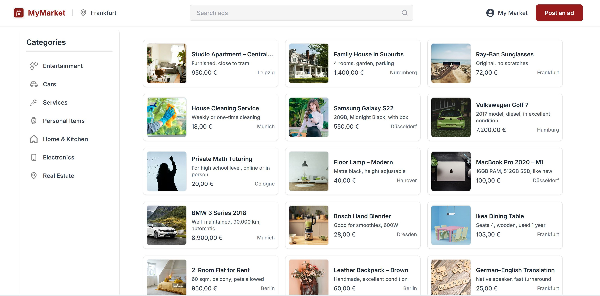

# My Market App 🛒

**My Market App** is a full-featured online marketplace platform inspired by Divar, where users can post, browse, and manage classified ads.

> 🔧 This is a **team project** — I was fully responsible for the **Frontend architecture and MongoDB integration**.

---

## 🚀 Features

- 📱 Fully responsive user interface built with **React** and **TailwindCSS**
- 🔁 Efficient data fetching using **React Query**
- 🔐 Authentication flow with OTP, JWT, and cookie-based session
- 📦 Image upload and preview using **FormData**
- 🧩 Modular component architecture and scalable folder structure
- 🧪 Connected to a **custom Express.js backend API** via REST
- 📊 Backend supports **Swagger documentation** and is structured by domain modules

---

## 🖼️ Frontend Stack

- [React](https://react.dev/)
- [TailwindCSS](https://tailwindcss.com/)
- [React Query](https://tanstack.com/query)
- [Axios](https://axios-http.com/)
- [Vite](https://vitejs.dev/)
- Cookie handling and token management with custom hooks

📁 Organized into:
```
src/
├── components/modules & templates
├── pages & layouts
├── services, utils, configs
├── router & styles
```

---

## 🗄️ Backend Overview

> Built by a teammate – Connected via REST API

- **Node.js** + **Express.js**
- **MongoDB** + **Mongoose**
- JWT authentication
- Modular structure by feature (`auth`, `user`, `post`, `category`, `option`)
- **Swagger** integration
- Custom exception handling and middleware

📁 Structure:
```
src/
├── common/       (constants, guards, exceptions)
├── config/       (mongoose, swagger)
├── modules/      (auth, user, post, category, option)
```

---

## 📸 Screenshots

Here’s a preview of the My Market App interface:




---

## 📦 Setup Instructions

### 🧪 Frontend
```bash
cd frontend
npm install
npm run dev
```

### 🧪 Backend
```bash
cd backend
npm install
npm run dev
```

📝 Configure `.env` files in both folders (API URLs, MongoDB URI, JWT secrets, etc.)

---

## 👩‍💻 About Me

I'm a junior full-stack developer with a strong focus on clean, modular frontend development.  
This project helped me practice **state management**, **authentication flows**, **component reuse**, and **API integration**.

---

## 📎 License

MIT – feel free to use and customize ✨

---

**Made with 💚 and ☕ by Soudabeh Noorollahi**
